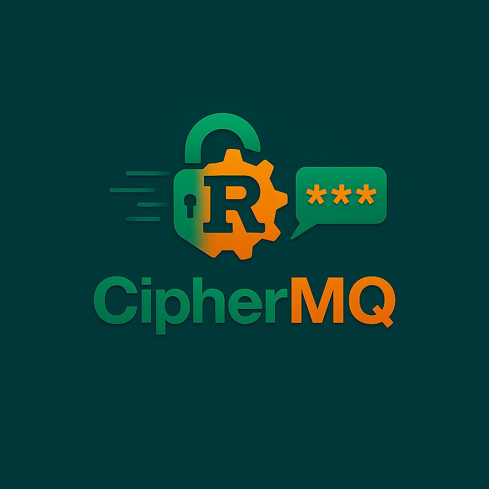
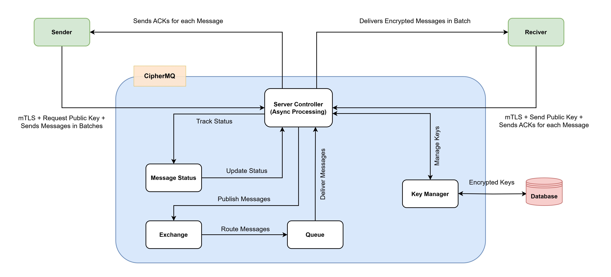

# CipherMQ: A New Generation Secure Message Broker


<p align="center">

</p>


    

**CipherMQ** is a secure, high-performance message broker designed for encrypted message transmission between senders and receivers using a push-based architecture. It leverages **hybrid encryption** (RSA + AES-GCM) for message confidentiality and authenticity, combined with **Mutual TLS (mTLS)** for secure client-server communication. The system ensures **zero message loss** and **exactly-once delivery** through robust acknowledgment mechanisms, with messages temporarily held in memory and routed via exchanges and queues.

This version introduces **TLS support**, enhancing security for client-server connections.

You can see some benchmarks regarding CipherMQ at [benchmark_report](benchmarks/benchmark_report.md). Initial architecture of CipherMQ is as follows:


<p align="center">

</p>


## Table of Contents
1. [Features](#features)
2. [Prerequisites](#prerequisites)
3. [Installation](#installation)
4. [Configuration](#configuration)
5. [Usage](#usage)
6. [Architecture](#architecture)
7. [Diagrams](#diagrams)
8. [Future Improvements](#future-improvements)
9. [Contributing](#contributing)
10. [License](#license)


## Features

- **Mutual TLS (mTLS)**: Secure client-server communication with two-way authentication using X.509 certificates.
- **Hybrid Encryption**: RSA encrypts session keys, and AES-GCM ensures message encryption and authentication.
- **Zero Message Loss**: Sender retries until server acknowledgment (`ACK <message_id>`), and server retries delivery until receiver acknowledgment (`ack <message_id>`).
- **Exactly-Once Delivery**: Receiver deduplicates messages using `message_id` to prevent reprocessing.
- **Batch Processing**: Sender collects and sends messages in batches, ensuring all queued messages are delivered.
- **Asynchronous Processing**: Built with Tokio for concurrent, high-performance connection handling.
- **Push-Based Messaging**: Messages are delivered to connected consumers.
- **Thread-Safe Data Structures**: Uses `DashMap` for safe multi-threaded operations.
- **Flexible Routing**: Supports exchanges and queues with routing keys for efficient message delivery.
- **Clear Acknowledgment Logging**: Both sender and receiver log ACKs for visibility (e.g., `✅ [SENDER] Server ACK received` and `✅ [RECEIVER] Server confirmed ACK`).


## Prerequisites

To run CipherMQ with TLS, you need:
- [Rust](https://www.rust-lang.org/): Version 1.56 or higher (for the server).
- [Python](https://www.python.org/): Version 3.8 or higher (for Sender and Receiver).
- [Key Generation](https://slproweb.com/products/Win32OpenSSL.html): Use OpenSSL or the provided `RSA.py` script to generate keys.


## Installation

### 1. Clone the Repository
```bash
git clone https://github.com/fozouni/CipherMQ.git
cd CipherMQ
```

### 2. Set up the Rust Server
```bash
cargo build --release
```
### 3. Generate mTLS Certificates
Generate a CA certificate, server certificate, and client certificate for mTLS:

> **Note**: Press Enter to skip each question
```bash
mkdir -p certs src/client/certs
cd certs
openssl genrsa -out ca.key 2048
openssl req -x509 -new -key ca.key -out ca.crt -days 3650 
openssl genrsa -out server.key 2048
openssl req -new -key server.key -out server.csr 
openssl x509 -req -in server.csr -CA ca.crt -CAkey ca.key -CAcreateserial -out server.crt -days 365
openssl genrsa -out client.key 2048
openssl req -new -key client.key -out client.csr 
openssl x509 -req -in client.csr -CA ca.crt -CAkey ca.key -CAcreateserial -out client.crt -days 365
rm server.csr client.csr ca.srl
cp ca.crt client.crt client.key ../src/client/certs/
```

This creates:
- `ca.crt`: Certificate Authority (CA) certificate for verifying server and client certificates.
- `server.crt`: Server certificate for mTLS.
- `server.key`: Server private key for mTLS.
- `client.crt`: Client certificate for mTLS.
- `client.key`: Client private key for mTLS.

> **Note**: Store `ca.key` securely and do not distribute it. It is only used for certificate generation.


### 4. Generate RSA Keys
Run the provided `RSA.py` script to generate RSA key pairs for hybrid encryption:
```bash
cd src/client
pip install pycryptodome
python RSA.py
```
This creates:
- `receiver_private.pem`: Receiver's private key for decryption.
- `receiver_public.pem`: Public key for sender encryption.


## Configuration

### Server Configuration
Create a `config.toml` file in the `CipherMQ` root directory:
```toml
connection_type = "tls"
address = "127.0.0.1:5672"
cert_path = "certs/server.crt"
key_path = "certs/server.key"
ca_cert_path = "certs/ca.crt"
```

### Client Configuration
Create a `config.json` file in both `sender/` and `receiver/` directories:
```json
{
  "exchange_name": "ciphermq_exchange",
  "queue_name": "ciphermq_queue",
  "routing_key": "ciphermq_key",
  "server_address": "127.0.0.1",
  "server_port": 5672,
  "tls": {
    "certificate_path": "certs/ca.crt",
    "client_cert_path": "certs/client.crt",
    "client_key_path": "certs/client.key",
    "protocol": "PROTOCOL_TLS_CLIENT",
    "verify_mode": "CERT_REQUIRED",
    "check_hostname": false
  }
}
```

> **Note**: Ensure `exchange_name`, `queue_name`, and `routing_key` match across Sender, Receiver, and server for proper message routing.

> **Security Note**: Restrict access to `server.key`, `client.key`, and `receiver_private.pem` (e.g., `chmod 600`).


## Usage
### 1. Run the Server
Start the server with TLS support:
```bash
cd root
cargo run --release
```

### 2. Run the Receiver
Start the receiver to subscribe to messages:
```bash
cd src/client
python Receiver.py
```
The receiver connects to the server via TLS, declares and binds to `ciphermq_queue`, decrypts messages, and saves them to `received_messages.jsonl`.

### 3. Run the Sender
Send encrypted messages in batches:
```bash
cd src/client
python Sender.py
```
The sender encrypts messages using hybrid encryption, sends them in batches via `ciphermq_exchange` and `ciphermq_key`, and retries until acknowledgment.


## Architecture

CipherMQ is a message broker system with the following components:
- **Server** (`main.rs`, `server.rs`, `connection.rs`, `state.rs`, `config.rs`, `auth.rs`): A Rust-based broker that handles mTLS connections, message routing, and delivery using exchanges and queues.
- **Sender** (`Sender.py`): Encrypts messages with hybrid encryption (RSA + AES-GCM), sends them in batches, and ensures delivery with retries.
- **Receiver** (`Receiver.py`): Receives, decrypts, deduplicates, and stores messages in JSONL format, with acknowledgment retries.
- **mTLS Integration** (`auth.rs`, `connection.rs`): Supports secure two-way authentication using `tokio-rustls` and `WebPkiClientVerifier`.
- **Hybrid Encryption**: Combines RSA for session key encryption and AES-GCM for message encryption and authentication.

For a detailed architecture overview, see [CipherMQ Project Architecture](docs/Project_Architecture.md).


## Diagrams
The following diagrams, located in `docs/diagrams`, illustrate CipherMQ's architecture and mTLS flow:
- **[Sequence Diagram](docs/diagrams/Sequence_diagram.png)**: Shows the end-to-end message flow, including mTLS handshakes.
- **[Activity Diagram](docs/diagrams/Activity_Diagram.png)**: Details the operational flow, including mTLS connection setup.

## Future Improvements
- Support standard protocols like AMQP or MQTT.
- Enable distributed server scaling.
- Implement certificate rotation and CRL/OCSP for enhanced security.
- Add support for Hardware Security Modules (HSM) for key management.

## Contributing
Contributions are welcome! Please:
1. Review the [Contributor License Agreement (CLA)](CLA.md).
2. Check the PR template checkbox to confirm agreement.
3. Follow coding standards and include tests.

For major changes, open an issue to discuss your proposal.

## License
This project is licensed under the MIT License. See the [LICENSE](LICENSE) file for details.
