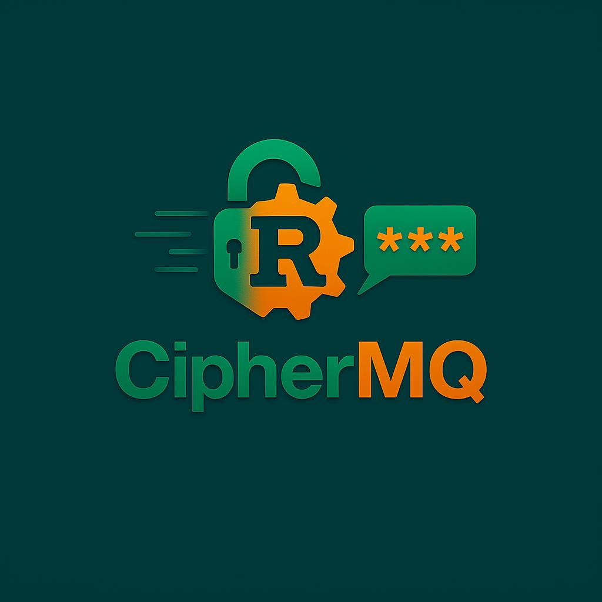
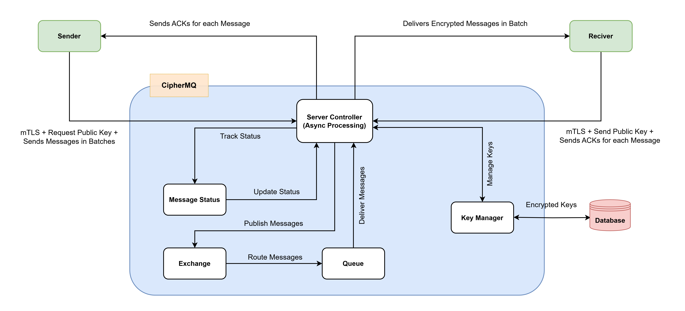

# CipherMQ: A New Generation Secure Message Broker

<p align="center">

</p>


   

**CipherMQ** is a secure, high-performance message broker for encrypted message transmission between senders and receivers using a push-based architecture. It leverages **hybrid encryption** X25519 (Elliptic-Curve Diffie-Hellman) combined with **XSalsa20-Poly1305** (NaCl/libsodium "sealed box" construction) to protect the per-message session key, and **ChaCha20-Poly1305** to encrypt the message payload itself for confidentiality and authenticity, combined with **Mutual TLS (mTLS)** for secure client-server communication. The system ensures **zero message loss** and **exactly-once delivery** through robust acknowledgment mechanisms, with messages temporarily held in memory and routed via exchanges and queues. Message metadata and receivers' public keys are stored in a PostgreSQL database; public keys at rest are additionally encrypted with **AES-256-GCM** before being persisted.


Initial architecture of CipherMQ is as follows:


<p align="center">

</p>


## Table of Contents
1. [Features](#features)
2. [Prerequisites](#prerequisites)
3. [Installation](#installation)
4. [Configuration](#configuration)
5. [Project Structure](#Project-Structure)
6. [Usage](#usage)
7. [Architecture](#architecture)
8. [Diagrams](#diagrams)
9. [Future Improvements](#future-improvements)
10. [Contributing](#contributing)
11. [License](#license)


## Features

- **Mutual TLS (mTLS)**: Ensures secure client-server communication with two-way authentication using ECDSA P-384 certificates.
- **Hybrid Encryption**: X25519 ECDH + XSalsa20-Poly1305 ("sealed box") protects the per-message session key; ChaCha20-Poly1305 encrypts the message payload.
- **Public Key Registration**: Receivers register their public keys with the server using the `register_public_key` command, which are securely stored and retrievable by senders via the `get_public_key` command.
- **Zero Message Loss**: Sender retries until server acknowledgment (`ACK <message_id>`), and server retries delivery until receiver acknowledgment (`ack <message_id>`).
- **Exactly-Once Delivery**: Receiver deduplicates messages using `message_id` to prevent reprocessing.
- **Batch Processing**: Sender collects and sends messages in batches, ensuring all queued messages are delivered.
- **Real-time Processing**: Sender transmits each message immediately upon generation, ensuring instant delivery without queuing or batching delays.
- **Asynchronous Processing**: Built with Tokio for concurrent, high-performance connection handling.
- **Push-Based Messaging**: Messages are delivered to connected receiver as soon as they are published.
- **Thread-Safe Data Structures**: Uses `DashMap` for safe multi-threaded operations on the broker's in-memory state.
- **Flexible Routing**: Supports exchanges and queues with routing keys for efficient message delivery.
- **Persistent Storage**: Stores message metadata and AES-256-GCM-encrypted public keys in PostgreSQL.
- **Structured Logging**: JSON-based logging with rotation and level-based filtering on the server; JSON file logging plus a readable console layer on both clients.


## Prerequisites

To run CipherMQ with TLS, you need:
- [Rust](https://www.rust-lang.org/): Version 1.56 or higher.
- [PostgreSQL](https://www.postgresql.org/): Version 10 or higher.
- Certificates & Key Generation: Use the provided Rust script to generate mTLS certificates & x25519 key pairs.


## Installation

### 1. Clone the Repository
```bash
git clone https://github.com/CipherSecurityLab/CipherMQ.git
```

### 2. Generate mTLS Certificates
Run the provided Rust certificate-authority tool to generate the CA certificate, server certificate, and one client certificate per Common Name you pass on the command line:

```bash
cd root
cd create_ca_key/Rust_CA_Maker_ECDSA_P-384_Multi_Client
cargo run -- receiver_1 sender_1 
```

This produces:
- `ca.crt`: Certificate Authority (CA) certificate for verifying server and client certificates.
- `server.crt`: Server certificate for mTLS.
- `server.key`: Server private key for mTLS.
- `client.crt`: Client certificate for mTLS.
- `client.key`: Client private key for mTLS.

> **Note**: Store `ca.key` securely and do not distribute it. It is only used for certificate generation.
> 
> **Security Note**: Restrict access to `server.key`, `client.key` (chmod 600).

### 3. Generate x25519 Keys

Run the provided script to generate x25519 key pairs for hybrid encryption for the receiver:
```bash
cd root
cd create_ca_key/Rust_Key_Maker_X25519
cargo run --release
```

Outputs::
- `receiver_private.key`: Receiver's private key for decryption.
- `receiver_public.key`: Public key for sender encryption.

> **Security Note**: Restrict access to  `receiver_private.key` (chmod 600).

### 4. Set up the Rust Server
```bash
cd root
cargo build --release
```

### 5. Set Up Database

Initialize PostgreSQL:

```sql
sudo -u postgres psql
CREATE USER mq_user WITH PASSWORD 'mq_pass';
CREATE DATABASE ciphermq;
GRANT ALL PRIVILEGES ON DATABASE ciphermq TO mq_user;
\c ciphermq
GRANT ALL PRIVILEGES ON SCHEMA public TO mq_user;
```


## Configuration

### Server Configuration
Create a `config.toml` file in the `CipherMQ` root directory:
```toml
[server]
address = "127.0.0.1:5672"
connection_type = "tls"

[tls]
cert_path = "./create_ca_key/Rust_CA_Maker_ECDSA_P-384_Multi_Client/certs/server.crt"
key_path = "./create_ca_key/Rust_CA_Maker_ECDSA_P-384_Multi_Client/certs/server.key"
ca_cert_path = "./create_ca_key/Rust_CA_Maker_ECDSA_P-384_Multi_Client/certs/ca.crt"

[logging]
level = "error"
info_file_path = "logs/server_info.log"
debug_file_path = "logs/server_debug.log"
error_file_path = "logs/server_error.log"
rotation = "daily"
max_size_mb = 100

[database]
host = "localhost"
port = 5432
user = "mq_user"
password = "mq_pass"
dbname = "ciphermq"

[encryption]
algorithm = "x25519_chacha20_poly1305"
aes_key = "YOUR_BASE64_ENCODED_32_BYTE_AES_KEY"
```

> **Note**: Replace `YOUR_BASE64_ENCODED_32_BYTE_AES_KEY` with a 32-byte key encoded in base64. Generate it using:
```bash
openssl rand -base64 32
```

### Client Configuration
Each client reads `config.json` from its own working directory (`clients/Sender_1/` and `clients/Receiver_1/`). The `exchange_name`, `queue_name`, and `routing_key` values must match across the Sender's `bindings`, the Receiver's top-level fields, and one another so that publishes route to the correct queue.

**Receiver (`clients/Receiver_1/config.json`)**
 
| Field | Description |
|---|---|
| `queue_name`, `exchange_name`, `routing_key` | Identify the queue this receiver declares, binds, and consumes from. |
| `server_address`, `server_port` | Broker TCP endpoint. |
| `tls.certificate_path` | CA certificate used to verify the server. |
| `tls.client_cert_path` / `tls.client_key_path` | This receiver's mTLS client certificate and key. |
| `tls.check_hostname` | When `false`, skips TLS hostname verification (the certificate chain is still validated); intended for development against `localhost` or IP-only endpoints. |
| `logging.*` | Log level and JSON log file paths. |
 
**Sender (`clients/Sender_1/config.json`)**
 
| Field | Description |
|---|---|
| `receiver_client_ids` | One client ID, or an array of client IDs, this sender will fetch public keys for and address messages to. |
| `exchange_name`, `bindings` | Exchange/queue/routing-key triples the sender declares and binds before publishing. |
| `server_address`, `server_port`, `tls.*` | Same meaning as on the Receiver. |
| `sender.num_messages` | Total number of messages to generate and send in this run. |
| `sender.max_inflight` | Maximum number of messages awaiting ACK at any one time (semaphore-bounded backpressure). |
| `sender.max_retries` | Retry attempts for an unacknowledged message before it is marked permanently failed. |
| `sender.ack_timeout_secs` | Seconds to wait for an ACK before a message is treated as unacknowledged. |
| `sender.tcp_connect_timeout_secs` | Seconds to wait while establishing each TCP connection. |
| `sender.batch_size` / `sender.batch_delay_ms` | Messages per logical batch and the pause between batches (for progress logging/pacing only). |
| `sender.message.content_template` | Template string for generated message bodies; supports `{sender_id}`, `{correlation_id}`, `{timestamp}`, `{seq}`, and any key from `extra_fields`. |
| `sender.message.extra_fields` | Extra key/value pairs available to the template. |


## Project Structure

```
CipherMQ/
├── src/
│   ├── main.rs               # Entry point for the server
│   ├── server.rs             # Client request handling and message processing
│   ├── connection.rs         # mTLS connection management
│   ├── state.rs              # Server state management (queues, exchanges, receiver)
│   ├── auth.rs               # mTLS authentication logic
│   ├── storage.rs            # PostgreSQL storage for metadata and public keys
│   ├── config.rs             # Configuration parsing and validation
│
├── Cargo.toml                # Rust dependencies
├── config.toml               # Server configuration
│
├── create_ca_key/
│   └── Rust_Key_Maker_X25519                       # Generate x25519 key
│   └── Rust_CA_Maker_ECDSA_P-384_Multi_Client      # Generate CA certificates
│
└── clients/
    │
    ├── Receiver_1/
    │   ├── Cargo.toml        # Rust dependencies
    │   ├── config.json       # Receiver configuration
    │   └── src/
    │       └── main.rs       # Entry point for the receiver
    │
    └── Sender_1/       
        ├── Cargo.toml        # Rust dependencies
        ├── config.json       # Sender configuration
        └── src/
            └── main.rs       # Entry point for the sender
```


## Usage

**Important:** Run these commands in **three separate terminal** in the specified order (Server → Receiver → Sender).

### 1. Run the Server (**First Terminal**)
Start the server with TLS support:
```bash
cd root
cargo run --release
```

Server listens on configured address, initializes DB connections, and awaits client registrations.

### 2. Run the Receiver (**Second Terminal**)

Start the receiver to subscribe to messages:
```bash
cd root
cd clients/Receiver_1
cargo run --release
```
- Registers public key.
- Declares queue & exchange.
- Decrypts incoming messages and persists to `data/received_messages.jsonl`.
- Sends `ack <message_id>` for every newly processed message and automatically reconnects if the connection drops.

### 3. Run the Sender (**Third Terminal**)

```bash
cd root
cd clients/Sender_1
cargo run --release
```
- Fetches receiver public key.
- Generates and hybrid-encrypts the configured number of sample messages for every receiver.
- Publishes them over an async pipeline bounded by `max_inflight`, retries unacknowledged messages with exponential backoff, and reports final throughput and failure counts.
 


## Architecture

CipherMQ is a message broker system with the following components:
- **Server** (`main.rs`, `server.rs`, `connection.rs`, `state.rs`, `config.rs`, `auth.rs`, `storage.rs`): A Rust-based broker that handles mTLS connections, message routing, and delivery using exchanges and queues. Public keys are encrypted with ChaCha20-Poly1305 and stored in an PostgreSQL database. The server supports the `register_public_key` command to store receiver public keys and the `get_public_key` command to provide them to senders.
- **Sender** (`clients/Sender_1/src/main.rs`): Fetches receiver public keys using `get_public_key`, hybrid-encrypts messages (X25519 sealed box + ChaCha20-Poly1305), sends them through an async, semaphore-bounded pipeline, and ensures delivery with retries.
- **Receiver** (`clients/Receiver_1/src/main.rs`): Registers its public key with the server using `register_public_key`, receives, decrypts, deduplicates, and stores messages in JSONL format, with acknowledgment retries.
- **mTLS Integration** (`auth.rs`, `connection.rs`): Supports secure two-way authentication using `tokio-rustls` and `WebPkiClientVerifier`.
- **Hybrid Encryption**: X25519 ECDH + XSalsa20-Poly1305 (sealed box) wraps a per-message session key; ChaCha20-Poly1305 encrypts the message content with that session key
- **Key Storage** (`storage.rs`): Public keys are encrypted with AES-256-GCM and stored in PostgreSQL, accessible via the `register_public_key` and `get_public_key` commands.

For a detailed architecture overview, see [CipherMQ Project Architecture](docs/Project_Architecture.md).


## Diagrams
The following diagrams, located in `docs/diagrams`, illustrate CipherMQ's architecture and mTLS flow:
- **[Sequence Diagram](docs/diagrams/Sequence_diagram.png)**: Shows the end-to-end message flow, including mTLS handshakes, public key registration, and hybrid encryption.
- **[Activity Diagram](docs/diagrams/Activity_Diagram.png)**: Details the operational flow, including mTLS connection setup, key registration, and message processing.
- **[Component Diagram](docs/diagrams/Component_Diagram.png)**: Maps the server's internal modules, the Sender and Receiver clients, and PostgreSQL, and how they connect.
- **[ER Diagram](docs/diagrams/ER_Diagram.png)**: Documents the `message_metadata` and `public_keys` PostgreSQL tables and their columns.
- **[Deployment Diagram](docs/diagrams/Deployment_Diagram.png)**: Shows where certificates and keys live, which ports are used, and the trust boundaries between hosts.
- **[Hybrid Cryptography Diagrams](https://ciphermq.com/docs/index.php/ciphermq-hybrid-cryptography-diagrams/)**: You can see more detailed and visualized diagrams regarding CipherMQ here.
- **[CipherMQ Full Key Exchange Process](https://ciphermq.com/docs/index.php/ciphermq-full-key-exchange-process/)**: You can see an animated version of key exchange process in the world of CipherMQ here.
- **[CipherMQ Secure Raft Cluster](https://ciphermq.com/docs/index.php/ciphermq-secure-raft-cluster/)**: An animated demonstration of the Raft consensus algorithm running securely within a CipherMQ cluster showing leader election, replication, failover, and recovery in a fully end-to-end encrypted environment.

## Future Improvements

- Implement distributed clustering using the Raft consensus algorithm.
- Add support for post-quantum cryptography (PQC) algorithms.
- Switch to deadpool_postgres with a connection Pool for enhanced database performance and scalability.
- A server status control dashboard with mTLS connection.
- Implement certificate rotation and CRL/OCSP for enhanced security.
- Add support for Hardware Security Modules (HSM) for key management.


## Contributing

Contributions are welcome! Please:

1. Review the [Contributor License Agreement (CLA)](CLA.md).
2. Check the PR template checkbox to confirm agreement.
3. Follow coding standards and include tests.

For major changes, open an issue to discuss your proposal.


## License

This project is licensed under the MIT License. See the [LICENSE](LICENSE) file for details.

