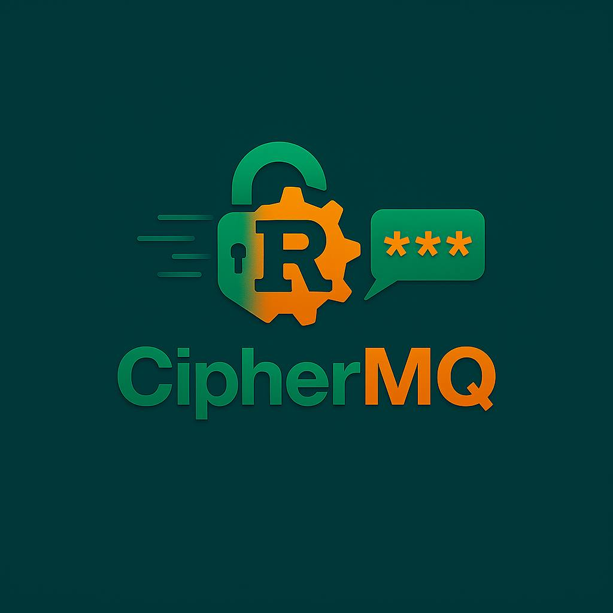
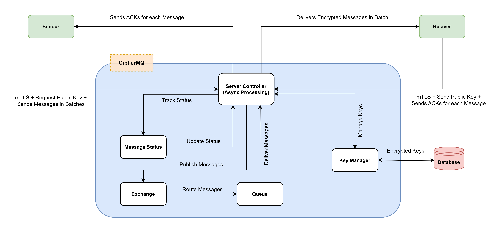

# CipherMQ: A New Generation Secure Message Broker

<p align="center">

</p>


   

**CipherMQ** is a secure, high-performance message broker for encrypted message transmission between senders and receivers using a push-based architecture. It leverages **hybrid encryption** X25519 (Elliptic-Curve Diffie-Hellman) combined with **XSalsa20-Poly1305** (NaCl/libsodium "sealed box" construction) to protect the per-message session key, and **ChaCha20-Poly1305** to encrypt the message payload itself for confidentiality and authenticity, combined with **Mutual TLS (mTLS)** for secure client-server communication. The system ensures **zero message loss** and **exactly-once delivery** through robust acknowledgment mechanisms, with messages temporarily held in memory and routed via exchanges and queues. Message metadata and receivers' public keys are stored in a PostgreSQL database; public keys at rest are additionally encrypted with **AES-256-GCM** before being persisted.

CipherMQ now includes **role-based Access Control (ACL)**, **rate limiting**, **Prometheus-compatible metrics**, a **real-time admin dashboard**, and **heartbeat monitoring** for production-grade deployments.


## Architecture at a Glance

<p align="center">

</p>


## Why CipherMQ?

| Problem | CipherMQ Solution |
|---|---|
| Messages intercepted in transit | mTLS between all clients and server |
| Messages readable by the broker | End-to-end encryption (broker never sees plaintext) |
| No guarantee of delivery | Sender retries + exactly-once delivery via ACK mechanism |
| No access control | Role-based ACL tied to mTLS certificate identities |
| No production visibility | Real-time admin dashboard + Prometheus metrics |
| Resource exhaustion attacks | Token-bucket rate limiting with per-IP/per-CN caps |


## Table of Contents

1. [Features](#features)
2. [Prerequisites](#prerequisites)
3. [Installation](#installation)
4. [Configuration](#configuration)
5. [Project Structure](#project-structure)
6. [Usage](#usage)
7. [Architecture](#architecture)
8. [Access Control (ACL)](#access-control-acl)
9. [Rate Limiting](#rate-limiting)
10. [Metrics & Monitoring](#metrics--monitoring)
11. [Admin Console](#admin-console)
12. [Diagrams](#diagrams)
13. [Future Improvements](#future-improvements)
14. [Contributing](#contributing)
15. [License](#license)


## Features

- **Mutual TLS (mTLS)**: Ensures secure client-server communication with two-way authentication using ECDSA P-384 certificates.
- **Hybrid Encryption**: X25519 ECDH + XSalsa20-Poly1305 ("sealed box") protects the per-message session key; ChaCha20-Poly1305 encrypts the message payload.
- **Role-Based Access Control (ACL)**: Clients are assigned roles (`sender`, `receiver`, `admin`) based on their mTLS certificate CN. Each role has a strict set of permitted commands senders cannot declare queues, receivers cannot publish, and unknown identities are rejected at connection time.
- **Rate Limiting**: Token-bucket rate limiting with per-role publish throttling, per-IP and per-CN connection limits to prevent abuse and resource exhaustion.
- **Prometheus-Compatible Metrics**: Atomic counters for messages published, acknowledged, delivered, errors, connections, and rate-limit rejections; gauge metrics for connected clients, queue count, messages in queues, consumers, and uptime all exportable in Prometheus text format.
- **Admin Console & Real-Time Dashboard**: A dedicated mTLS-secured admin server exposes node status as JSON and Prometheus metrics; a companion web dashboard (Axum + HTML) polls the admin server and renders live server health, queue details, binding maps, connection statistics, and counter data.
- **Heartbeat Monitoring**: Receivers send periodic heartbeats; the server tracks liveness per client and automatically cleans up timed-out connections.
- **Public Key Registration**: Receivers register their public keys with the server using the `register_public_key` command, which are securely stored and retrievable by senders via the `get_public_key` command.
- **Zero Message Loss**: Sender retries until server acknowledgment (`ACK <message_id>`), and server retries delivery until receiver acknowledgment (`ack <message_id>`).
- **Exactly-Once Delivery**: Receiver deduplicates messages using `message_id` to prevent reprocessing.
- **Batch Processing**: Sender collects and sends messages in batches, ensuring all queued messages are delivered.
- **Real-time Processing**: Sender transmits each message immediately upon generation, ensuring instant delivery without queuing or batching delays.
- **Asynchronous Processing**: Built with Tokio for concurrent, high-performance connection handling.
- **Push-Based Messaging**: Messages are delivered to connected receiver as soon as they are published.
- **Thread-Safe Data Structures**: Uses `DashMap` for safe multi-threaded operations on the broker's in-memory state.
- **Flexible Routing**: Supports exchanges and queues with routing keys for efficient message delivery.
- **Persistent Storage**: Stores message metadata and AES-256-GCM-encrypted public keys in PostgreSQL.
- **Structured Logging**: JSON-based logging with rotation and level-based filtering on the server; JSON file logging plus a readable console layer on both clients.


## Prerequisites

To run CipherMQ with TLS, you need:
- [Rust](https://www.rust-lang.org/): Version 1.56 or higher.
- [PostgreSQL](https://www.postgresql.org/): Version 10 or higher.
- Certificates & Key Generation: Use the provided Rust script to generate mTLS certificates & x25519 key pairs.


## Installation

### 1. Clone the Repository
```bash
git clone https://github.com/CipherSecurityLab/CipherMQ.git
```

### 2. Generate mTLS Certificates
Run the provided Rust certificate-authority tool to generate the CA certificate, server certificate, and one client certificate per Common Name you pass on the command line:

```bash
cd root
cd create_ca_key/Rust_CA_Maker_ECDSA_P-384_Multi_Client
cargo run -- receiver_1 sender_1 admin
```

This produces:
- `ca.crt`: Certificate Authority (CA) certificate for verifying server and client certificates.
- `server.crt`: Server certificate for mTLS.
- `server.key`: Server private key for mTLS.
- `client.crt`: Client certificate for mTLS (one set per CN: `sender_1`, `receiver_1`, `admin`).
- `client.key`: Client private key for mTLS.

> **Note**: Store `ca.key` securely and do not distribute it. It is only used for certificate generation.
> 
> **Security Note**: Restrict access to `server.key`, `client.key` (chmod 600).

### 3. Generate x25519 Keys

Run the provided script to generate x25519 key pairs for hybrid encryption for the receiver:
```bash
cd root
cd create_ca_key/Rust_Key_Maker_X25519
cargo run --release
```

Outputs:
- `receiver_private.key`: Receiver's private key for decryption.
- `receiver_public.key`: Public key for sender encryption.

> **Security Note**: Restrict access to `receiver_private.key` (chmod 600).

### 4. Set up the Rust Server
```bash
cd root
cd server
cargo build --release
```

### 5. Set Up Database

Initialize PostgreSQL:

```sql
sudo -u postgres psql
CREATE USER mq_user WITH PASSWORD 'mq_pass';
CREATE DATABASE ciphermq;
GRANT ALL PRIVILEGES ON DATABASE ciphermq TO mq_user;
\c ciphermq
GRANT ALL PRIVILEGES ON SCHEMA public TO mq_user;
```

## Configuration

### Server Configuration
Create a `config.toml` file in the `CipherMQ` root directory:

```toml
[server]
address = "127.0.0.1:5672"
connection_type = "tls"

[tls]
cert_path = "../create_ca_key/Rust_CA_Maker_ECDSA_P-384_Multi_Client/certs/server.crt"
key_path = "../create_ca_key/Rust_CA_Maker_ECDSA_P-384_Multi_Client/certs/server.key"
ca_cert_path = "../create_ca_key/Rust_CA_Maker_ECDSA_P-384_Multi_Client/certs/ca.crt"

[logging]
level = "error"
info_file_path = "logs/server_info.log"
debug_file_path = "logs/server_debug.log"
error_file_path = "logs/server_error.log"
rotation = "daily"
max_size_mb = 100

[database]
host = "localhost"
port = 5432
user = "mq_user"
password = "mq_pass"
dbname = "ciphermq"

[encryption]
algorithm = "x25519_chacha20_poly1305"
aes_key = "YOUR_BASE64_ENCODED_32_BYTE_AES_KEY"

[performance]
max_queue_size = 10000
heartbeat_timeout = 60
cleanup_interval = 3000
consumer_cleanup_interval = 60
idle_timeout_sec = 60

[admin]
enabled = true
address = "127.0.0.1:9091"
allowed_cns = ["admin"]

[rate_limit]
enabled = true
global_rps = 100.0
global_burst = 200.0
publish_rps = 50.0
publish_burst = 100.0
max_connections_per_ip = 50
max_connections_per_cn = 20

[acl]
sender_cns = ["sender_1"]
receiver_cns = ["receiver_1"]
admin_cns = ["admin"]
```

> **Note**: Replace `YOUR_BASE64_ENCODED_32_BYTE_AES_KEY` with a 32-byte key encoded in base64. Generate it using:
```bash
openssl rand -base64 32
```

### Configuration Sections

| Section | Description |
|---|---|
| `[server]` | Broker listen address and connection type (`tls`) |
| `[tls]` | Paths to server certificate, private key, and CA certificate for mTLS |
| `[logging]` | Log level, file paths, rotation policy, and max file size |
| `[database]` | PostgreSQL connection parameters |
| `[encryption]` | Encryption algorithm and AES-256-GCM key for encrypting public keys at rest |
| `[performance]` | Max queue size, heartbeat timeout, cleanup intervals, idle timeout |
| `[admin]` | Admin console toggle, listen address, and allowed admin CNs |
| `[rate_limit]` | Global and publish-specific RPS/burst limits, per-IP and per-CN connection caps |
| `[acl]` | Client CN → role mapping for `sender`, `receiver`, and `admin` roles |

### Client Configuration
Each client reads `config.json` from its own working directory (`clients/sender_1/`, `clients/receiver_1/`, `clients/admin/`). The `exchange_name`, `queue_name`, and `routing_key` values must match across the Sender's `bindings`, the Receiver's top-level fields, and one another so that publishes route to the correct queue.

**Receiver (`clients/receiver_1/config.json`)**

| Field | Description |
|---|---|
| `queue_name`, `exchange_name`, `routing_key` | Identify the queue this receiver declares, binds, and consumes from. |
| `server_address`, `server_port` | Broker TCP endpoint. |
| `tls.certificate_path` | CA certificate used to verify the server. |
| `tls.client_cert_path` / `tls.client_key_path` | This receiver's mTLS client certificate and key. |
| `tls.check_hostname` | When `false`, skips TLS hostname verification (the certificate chain is still validated); intended for development against `localhost` or IP-only endpoints. |
| `logging.*` | Log level and JSON log file paths. |

**Sender (`clients/sender_1/config.json`)**

| Field | Description |
|---|---|
| `receiver_client_ids` | One client ID, or an array of client IDs, this sender will fetch public keys for and address messages to. |
| `exchange_name`, `bindings` | Exchange/queue/routing-key triples the sender declares and binds before publishing. |
| `server_address`, `server_port`, `tls.*` | Same meaning as on the Receiver. |
| `sender.num_messages` | Total number of messages to generate and send in this run. |
| `sender.max_inflight` | Maximum number of messages awaiting ACK at any one time (semaphore-bounded backpressure). |
| `sender.max_retries` | Retry attempts for an unacknowledged message before it is marked permanently failed. |
| `sender.ack_timeout_secs` | Seconds to wait for an ACK before a message is treated as unacknowledged. |
| `sender.tcp_connect_timeout_secs` | Seconds to wait while establishing each TCP connection. |
| `sender.batch_size` / `sender.batch_delay_ms` | Messages per logical batch and the pause between batches (for progress logging/pacing only). |
| `sender.message.content_template` | Template string for generated message bodies; supports `{sender_id}`, `{correlation_id}`, `{timestamp}`, `{seq}`, and any key from `extra_fields`. |
| `sender.message.extra_fields` | Extra key/value pairs available to the template. |

**Admin Console (`clients/admin/config.json`)**

| Field | Description |
|---|---|
| `server_name` | Display name shown on the dashboard. |
| `poll_interval_secs` | How often the admin client polls the server for status data. |
| `web_address` | Address the web dashboard listens on (`host:port`). |
| `tls.*` | CA cert, client cert, and client key for mTLS connection to the admin server. |
| `server.admin_address` | The server's admin console endpoint (`host:port`). |


## Project Structure

```
CipherMQ/
├── server/
│   ├── src/
│   │   ├── main.rs               # Entry point: logging, state init, ACL, heartbeat monitor, shutdown
│   │   ├── server.rs             # Client request handling, ACL enforcement, message processing
│   │   ├── connection.rs         # mTLS connection management and CN extraction
│   │   ├── state.rs              # Server state: queues, exchanges, bindings, consumers (DashMap)
│   │   ├── auth.rs               # mTLS authentication (WebPkiClientVerifier)
│   │   ├── storage.rs            # PostgreSQL storage actor: metadata, encrypted public keys
│   │   ├── config.rs             # Configuration parsing and validation
│   │   ├── acl.rs                # Role-based access control (Role enum, AclManager, permission checks)
│   │   ├── rate_limiter.rs       # Token-bucket rate limiter with per-IP/per-CN connection limits
│   │   ├── metrics.rs            # Atomic counters, Prometheus exporter, status renderer
│   │   └── admin_server.rs       # mTLS admin console: JSON status, Prometheus metrics, queue info
│   ├── Cargo.toml                # Rust dependencies
│   └── config.toml               # Server configuration (all sections)
│
├── clients/
│   ├── sender_1/
│   │   ├── Cargo.toml            # Sender dependencies
│   │   ├── config.json           # Sender configuration
│   │   └── src/
│   │       └── main.rs           # Sender: fetch keys, hybrid-encrypt, async pipeline with backpressure
│   │
│   ├── receiver_1/
│   │   ├── Cargo.toml            # Receiver dependencies
│   │   ├── config.json           # Receiver configuration
│   │   └── src/
│   │       └── main.rs           # Receiver: register key, consume, decrypt, ack, reconnect
│   │
│   └── admin/
│       ├── Cargo.toml            # Admin console dependencies
│       ├── config.json           # Admin console configuration
│       └── src/
│           ├── main.rs           # Axum web server with /api/status endpoint
│           ├── poll.rs           # Background polling thread over mTLS
│           └── dashboard.html    # Real-time HTML dashboard
│
├── docs/                         # Documentation and diagrams
└── create_ca_key/                # Certificate and key generation utilities
```


## Usage

**Important:** Run these commands in **four separate terminals** in the specified order (Server → Receiver → Sender → Admin).

### 1. Run the Server (**First Terminal**)
Start the server with TLS support:
```bash
cd root
cd server
cargo run --release
```
Server listens on configured address, initializes DB connections, ACL, rate limiter, metrics, heartbeat monitor, and admin console (if enabled), then awaits client registrations.

### 2. Run the Receiver (**Second Terminal**)

Start the receiver to subscribe to messages:
```bash
cd root
cd clients/receiver_1
cargo run --release
```
- Registers public key with the server.
- Declares queue & exchange.
- Subscribes as a push consumer.
- Sends periodic heartbeats.
- Decrypts incoming messages and persists to `data/received_messages.jsonl`.
- Sends `ack <message_id>` for every newly processed message and automatically reconnects if the connection drops.

### 3. Run the Sender (**Third Terminal**)

```bash
cd root
cd clients/sender_1
cargo run --release
```
- Fetches receiver public key.
- Generates and hybrid-encrypts the configured number of sample messages for every receiver.
- Publishes them over an async pipeline bounded by `max_inflight`, retries unacknowledged messages with exponential backoff, and reports final throughput and failure counts.

### 4. Run the Admin Console (**Fourth Terminal**)

```bash
cd root
cd clients/admin
cargo run --release
```
- Connects to the server's admin endpoint over mTLS.
- Opens a web dashboard at the configured `web_address` (default: `http://127.0.0.1:8080`).
- Displays real-time server health, queue details, binding maps, connection statistics, and counter data.


## Architecture

CipherMQ is a message broker system with the following components:
- **Server** (`server/src/`): A Rust/Tokio broker that handles mTLS connections, message routing, and delivery using exchanges and queues. Includes role-based ACL enforcement, token-bucket rate limiting, Prometheus-compatible metrics, heartbeat monitoring, and an mTLS-secured admin console. Public keys are encrypted with AES-256-GCM and stored in PostgreSQL.
- **Sender** (`clients/sender_1/`): Fetches receiver public keys using `get_public_key`, hybrid-encrypts messages (X25519 sealed box + ChaCha20-Poly1305), sends them through an async, semaphore-bounded pipeline, and ensures delivery with retries.
- **Receiver** (`clients/receiver_1/`): Registers its public key with the server using `register_public_key`, receives, decrypts, deduplicates, and stores messages in JSONL format, with acknowledgment retries and periodic heartbeats.
- **Admin Console** (`clients/admin/`): An Axum-based web dashboard that polls the server's admin endpoint over mTLS and renders real-time node status, queue/binding/exchange details, connection statistics, and Prometheus metrics.
- **mTLS Integration** (`auth.rs`, `connection.rs`): Supports secure two-way authentication using `tokio-rustls` and `WebPkiClientVerifier`.
- **Hybrid Encryption**: X25519 ECDH + XSalsa20-Poly1305 (sealed box) wraps a per-message session key; ChaCha20-Poly1305 encrypts the message content with that session key.
- **Key Storage** (`storage.rs`): Public keys are encrypted with AES-256-GCM and stored in PostgreSQL, accessible via the `register_public_key` and `get_public_key` commands.

For a detailed architecture overview, see [CipherMQ Project Architecture](docs/Project_Architecture.md).


## Access Control (ACL)

CipherMQ enforces role-based access control by mapping each client's mTLS certificate Common Name (CN) to one of three roles:

| Role | CNs (configurable) | Permitted Commands |
|---|---|---|
| **Sender** | `sender_cns` in `[acl]` | `publish`, `publish_batch`, `get_public_key`, `ack`, `resend` |
| **Receiver** | `receiver_cns` in `[acl]` | `declare_queue`, `declare_exchange`, `bind`, `consume`, `ack`, `register_public_key`, `heartbeat` |
| **Admin** | `admin_cns` in `[acl]` | All commands (full access) |
| **Unknown** | (any CN not listed) | **Rejected at connection time** no commands available |

ACL is enforced in two places:
1. **Connection time** (`server.rs`): Unknown CNs are rejected immediately with `Access denied: unrecognized client identity`.
2. **Per-command** (`server.rs`): Each command is checked against the permission matrix before execution. Denied commands receive `Access denied: <reason> (role=<role>)`.

The admin console also verifies that connecting clients have an admin CN before serving any data.


## Rate Limiting

CipherMQ includes a token-bucket rate limiter with configurable parameters:

| Parameter | Default | Description |
|---|---|---|
| `global_rps` | 100.0 | Maximum requests per second per client CN (all commands) |
| `global_burst` | 200.0 | Burst capacity for the global bucket |
| `publish_rps` | 50.0 | Additional rate limit for `publish`/`publish_batch` commands per CN |
| `publish_burst` | 100.0 | Burst capacity for the publish bucket |
| `max_connections_per_ip` | 50 | Maximum concurrent connections from a single IP address |
| `max_connections_per_cn` | 20 | Maximum concurrent connections per client CN |

Rate limiting can be toggled on/off via `[rate_limit].enabled`. When a request is rate-limited, the server responds with `Rate limited`. When a connection is rejected due to connection limits, the connection is silently closed.


## Metrics & Monitoring

CipherMQ exposes Prometheus-compatible metrics on the admin server endpoint (`metrics` command):

**Counters:**
- `ciphermq_messages_published_total` Total messages published
- `ciphermq_messages_acked_total` Total messages acknowledged
- `ciphermq_messages_delivered_total` Total messages delivered
- `ciphermq_errors_total` Total server errors
- `ciphermq_connections_total` Accepted client connections
- `ciphermq_connections_rejected_rate_limit_total` Connections rejected by rate limit
- `ciphermq_connections_rejected_conn_limit_total` Connections rejected by connection limit
- `ciphermq_requests_rate_limited_total` Requests rejected by rate limit

**Gauges:**
- `ciphermq_connected_clients` Current connected clients
- `ciphermq_queue_count` Current queue count
- `ciphermq_messages_in_queues` Messages currently in queues
- `ciphermq_consumer_count` Current consumers
- `ciphermq_uptime_seconds` Server uptime

All counters use lock-free atomic operations (`AtomicU64`) for high-concurrency performance.


## Admin Console

The admin console provides two interfaces:

### 1. Terminal Admin Client
A text-based mTLS client that connects to the server's admin endpoint and supports:
- `status` Human-readable server status
- `json` Full JSON status with queues, bindings, exchanges, connection stats
- `metrics` Prometheus-format metrics
- `queues` Queue counts and message totals
- `connections` Per-IP and per-CN connection breakdown
- `quit` / `exit` Disconnect

### 2. Web Dashboard
An Axum-based web server that polls the admin endpoint and renders a real-time HTML dashboard showing:
- Server health and uptime
- Connected clients, queues, consumers, exchanges
- Messages published, acknowledged, delivered
- Rate-limit rejections and connection limits
- Per-queue message counts and consumer counts
- Full binding map (exchange → queue → routing_key)
- Connection statistics by IP and CN


## Diagrams

The following diagrams, located in `docs/diagrams`, illustrate CipherMQ's architecture and mTLS flow:
- **[Sequence Diagram](docs/diagrams/Sequence_diagram.png)**: Shows the end-to-end message flow, including mTLS handshakes, public key registration, and hybrid encryption.
- **[Activity Diagram](docs/diagrams/Activity_Diagram.png)**: Details the operational flow, including mTLS connection setup, key registration, and message processing.
- **[Component Diagram](docs/diagrams/Component_Diagram.png)**: Maps the server's internal modules, the Sender and Receiver clients, and PostgreSQL, and how they connect.
- **[ER Diagram](docs/diagrams/ER_Diagram.png)**: Documents the `message_metadata` and `public_keys` PostgreSQL tables and their columns.
- **[Deployment Diagram](docs/diagrams/Deployment_Diagram.png)**: Shows where certificates and keys live, which ports are used, and the trust boundaries between hosts.


## Future Improvements 

- ⌛ Implement distributed clustering using the Raft consensus algorithm.

- ⌛ Add support for post-quantum cryptography (PQC) algorithms.

- Add support for Hardware Security Modules (HSM) for key management.

  

## Contributing

Contributions are welcome! Please:

1. Review the [Contributor License Agreement (CLA)](CLA.md).
2. Check the PR template checkbox to confirm agreement.
3. Follow coding standards and include tests.

For major changes, open an issue to discuss your proposal.


## License

This project is licensed under the MIT License. See the [LICENSE](LICENSE) file for details.
