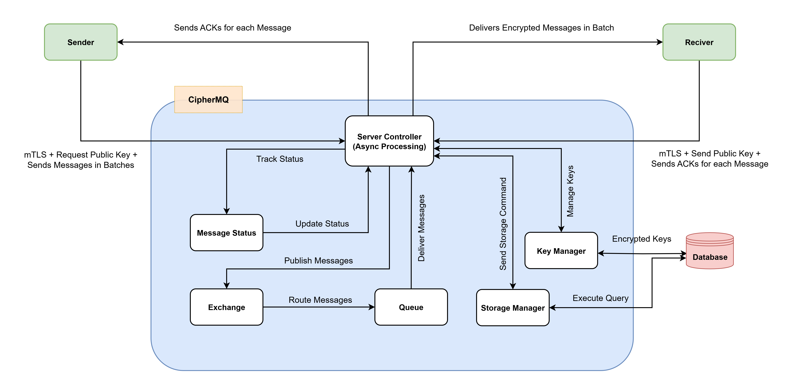

# CipherMQ: A new generation secure message broker

<p align="center">

</p>


**CipherMQ** is a secure message broker system designed to transmit encrypted messages between senders and receivers using a push-based architecture. It leverages hybrid encryption (RSA + AES-GCM) to ensure message confidentiality and authenticity. The server temporarily holds messages in memory (without persistent storage except for logs) and routes them through exchanges and queues to connected consumers.

This project consists of three main components:
- **Server** (`main.rs`): A Rust-based message broker for receiving, routing, and delivering messages.
- **Sender** (`Sender.py`): A Python script that encrypts and sends messages to the server.
- **Receiver** (`Receiver.py`): A Python script that receives, decrypts, and stores messages.

Initial architecture of CipherMQ is as follows:

<p align="center">

</p>

## Table of Contents
1. [Features](#features)
2. [Prerequisites](#prerequisites)
3. [Installation](#installation)
4. [Usage](#usage)
5. [Architecture](#architecture)
6. [Diagrams](#diagrams)
7. [Future Improvements](#future-improvements)
8. [Contributing](#contributing)
9. [License](#license)

## Features
- **Hybrid Encryption**: Combines RSA for session key encryption and AES-GCM for message encryption and authentication.
- **Push-Based Messaging**: Messages are actively delivered to connected consumers.
- **Flexible Routing**: Supports exchanges and queues with routing keys for message delivery.
- **Message Acknowledgment**: Ensures reliable delivery with acknowledgment (`ack`) mechanism.
- **Asynchronous Processing**: Uses Tokio for high-performance, concurrent connection handling.
- **Thread-Safe Data Structures**: Leverages `DashMap` for safe multi-threaded operations.

## Prerequisites
To run CipherMQ, you need:
- [Rust](https://www.rust-lang.org/) : Version 1.56 or higher (for the server). 
- [Python](https://www.python.org/) : Version 3.8 or higher (for Sender and Receiver).
- [Key Generation](https://slproweb.com/products/Win32OpenSSL.html) : Use OpenSSL or the provided `RSA.py` script to generate keys.


## Installation
### 1. Clone the Repository
```bash
git clone https://github.com/fozouni/CipherMQ.git
cd CipherMQ
```
### 2. Set up the Rust server
```bash
cd src
cargo build --release
```
### 3. Generate RSA Keys
Run the provided `RSA.py` script to generate public and private keys:
```bash
cd src/client
pip install pycryptodome
python RSA.py
```
This creates:
- `receiver_private.pem`: The receiver's private key.
- `receiver_public.pem`: The receiver's public key.

**Alternatively**, use OpenSSL:
```bash
openssl genrsa -out receiver_private.pem 2048
openssl rsa -in receiver_private.pem -pubout -out receiver_public.pem
```

> **Note**: Store the private key securely to prevent unauthorized access.

## Usage
### 1. Run the Server
   ```bash
   cd src
   cargo run --release
   ```
   The server runs on `127.0.0.1:5672` and initializes a default queue (`default_queue`) and exchange (`default_exchange`) with the routing key `default_key`.

### 2. Run the Receiver
Start the receiver to listen for messages:
```bash
cd src/client
python Receiver.py
```
The receiver connects to the server, subscribes to `default_queue`, decrypts messages, and stores them in `received_messages.json`.

### 3. Run the Sender
Send a sample message:
```bash
cd src/client
python Sender.py
```
The sender encrypts a test message ("This is a hybrid test message.") and sends it to the server via `default_exchange` and `default_key`.

### 4. Supported Client Commands
Clients communicate with the server using a simple TCP-based text protocol. Supported commands:
- `declare_queue <queue_name>`: Creates a new queue.
- `declare_exchange <exchange_name>`: Creates a new exchange.
- `bind <exchange_name> <queue_name> <routing_key>`: Binds a queue to an exchange with a routing key.
- `publish <exchange_name> <routing_key> <message_json>`: Publishes an encrypted message.
- `consume <queue_name>`: Subscribes to a queue for message delivery.
- `fetch <queue_name>`: Manually retrieves a message from a queue.
- `ack <message_id>`: Acknowledges a message.

## Architecture
CipherMQ architecture is based on a message broker model with the following components:
- **Server** (`main.rs`): Manages message routing and delivery using exchanges and queues.
- **Sender** (`Sender.py`): Encrypts messages using hybrid encryption and sends them to the server.
- **Receiver** (`Receiver.py`): Receives, decrypts, and stores messages in a JSON file.
- **Hybrid Encryption**: Combines RSA for session key encryption and AES-GCM for message encryption and authentication.

For a detailed breakdown of the architecture, including components, interactions, and server details, refer to the [CipherMQ Project Architecture](docs/Project_Architecture.markdown) document in the `docs` directory.

## Diagrams
The following diagrams illustrate the architecture and operational flow of CipherMQ. They are located in the `docs/diagrams` directory:

- **[Sequence Diagram](docs/diagrams/Sequence_diagram.png)**: This diagram shows the end-to-end flow of a message through the system.

- **[Activity Diagram](docs/diagrams/Activity_Diagram.png)**: This diagram illustrates the operational flow and processes of CipherMQ.

To view the diagrams, open the PNG files in the `docs/diagrams` directory. 

## Future Improvements
- Add TLS support for secure client-server communication.
- Implement client authentication (e.g., JWT or OAuth).
- Enable persistent message storage (e.g., using SQLite or another database).
- Support standard protocols like AMQP or MQTT.
- Scale with distributed servers (e.g., inspired by Kafka or RabbitMQ).

## Contributing
Contributions are welcome! Please:
1. Fork the repository.
2. Create a feature branch (`git checkout -b feature/your-feature`).
3. Commit changes (`git commit -m 'Add your feature'`).
4. Push to the branch (`git push origin feature/your-feature`).
5. Open a pull request.

For major changes, please open an issue to discuss your ideas first.

## License
This project is licensed add licensed under the MIT License. See the [LICENSE](LICENSE) file for details.
